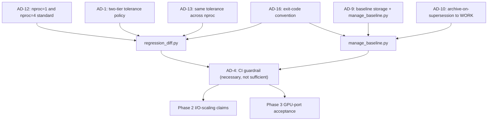

# Architecture Spine — RegCM5 HPC Modernization Architecture

## Design Paradigm

Fortran HPC batch SPMD model, read off the existing code and `project-context.md`, not re-derived this session:

- **Parallelism**: 2D MPI domain decomposition over `(iy, jx)`, parameters in `Share/mod_dynparam.F90` (`nproc`/`myid`, `njxcpus`/`niycpus`, `iyp`/`jxp`). All new parallel code goes through this decomposition.
- **Loop-parallelism/accelerator construct**: `do concurrent` is the sole construct; NVHPC compiles the same source to `-stdpar=multicore` (CPU) or `-stdpar=gpu` depending on build flag. Escalation to OpenACC only after profiling shows `do concurrent` insufficient (AD-3). No OpenMP, no OpenMP-target, no CUDA Fortran.
- **Layers -> directories**: `Main/` (model core + physics libraries), `Share/` (cross-cutting utilities, precision kinds `mod_realkinds`, halo exchange `mod_mppparam`), `PreProc/` (ICBC/terrain/emissions preprocessing), `PostProc/`, `external/` (bundled third-party, including the `mpi-serial` stub for serial builds).
- **Precision**: `rkx` (`mod_realkinds`) is the sole sanctioned precision knob, compile-time switchable single/double.

## Invariants & Rules

### AD-1 — Two-tier numerical reproducibility policy [ADOPTED]

- **Binds:** FR-25, FR-37, all GPU-porting work (FR-9, FR-10, FR-11)
- **Prevents:** CPU-only changes silently accepting non-bit-exact drift; GPU-ported code being held to an unreachable bit-exact bar, or to an unreviewed looser one
- **Rule:** CPU-only changes default to bit-exact (zero tolerance). CPU-to-GPU porting specifically is accepted at the source thesis's measured statistical bounds: `tas`/`ps` rMAD and rRMSE < 0.1%, `huss` < 5%, over a 7-model-day run. No third tier. Changeable only with regcm5-dev's explicit sign-off. A newly GPU-ported output field not yet in this table (e.g. a MOLOCH-advection wind field) defaults to bit-exact until its own measured tolerance is added to `regression_diff.py`'s tolerance table or a `--tolerance-file` — omission is the bit-exact default applying as designed, not a bug to route around.

### AD-2 — Profiling method [ADOPTED]

- **Binds:** FR-1-FR-4, FR-9's go/no-go evidence
- **Prevents:** performance claims backed by intuition rather than measurement; GPU compiler-runtime symbols (e.g. `__c_mset16_avx`) going unattributed to a source-level call stack
- **Rule:** `perf --call-graph dwarf` (requires `-g`) + Brendan Gregg FlameGraph rendering for CPU stacks; NVIDIA Nsight Systems for GPU/compiler-runtime symbol attribution `perf` cannot resolve; `-Minfo=accel` to confirm what a region actually offloaded.

### AD-3 — Accelerator escalation policy [ADOPTED]

- **Binds:** FR-8, FR-9, FR-10, FR-11, all `do concurrent` code
- **Prevents:** an OpenMP/OpenMP-target/CUDA Fortran track re-emerging; escalating to OpenACC before profiling justifies it
- **Rule:** `do concurrent` is the sole loop-parallelism construct; escalate to OpenACC only after profiling shows `do concurrent` insufficient for a given kernel. Already the merged pattern for the 4 confirmed hotspots (`getcape`, CLM-hydrology memset, `interp1d_r8`, `heatindex`), which offload via OpenACC directly, not `do concurrent`.

### AD-4 — CI guardrail [ADOPTED]

- **Binds:** FR-31, FR-32, every physics/dynamics/accelerator change
- **Prevents:** a green GitHub Actions check being mistaken for full acceptance evidence
- **Rule:** a green GitHub Actions check (GNU+Intel container builds + regression-diff, FR-31/32) is necessary but not sufficient. Final acceptance for physics/dynamics/accelerator changes requires Slurm validation on `dcgp_usr_prod` (Intel) and `boost_usr_prod` (NVHPC).

### AD-5 — GPU-port candidacy is case-by-case

- **Binds:** FR-9, FR-10, FR-11, any future GPU-porting proposal
- **Prevents:** inventing, or assuming, a reusable go/no-go scoring formula that does not exist
- **Rule:** each subsystem gets its own FR-9-style investigation and go/no-go checkpoint; this is a standing policy, not a fixed formula. Revisit only if case-by-case review becomes a bottleneck.

### AD-6 — I/O opt-in mechanism: per-path independent namelist switches [ADOPTED]

- **Binds:** FR-5, FR-6, FR-33
- **Prevents:** a single unified parallel-I/O switch coupling paths that resolve on different timelines
- **Rule:** each output path (diagnostic/history, restart/checkpoint, CLM land-model history) gets its own `do_parallel_netcdf_<path>`-style namelist switch. `do_parallel_netcdf_in`/`do_parallel_netcdf_out` already exist for ICBC input (`mod_params.F90`/`mod_clm_params.F90`) and restart (`mod_savefile.F90`). `mod_ncout.F90` (FR-5) currently has none and must add one following that naming convention, not invent a different shape.

### AD-7 — NVHPC build matrix: both OpenACC memory modes required

- **Binds:** FR-8, FR-10, every native NVHPC build
- **Prevents:** `--enable-openacc-stdpar` being treated as an occasional check rather than an equally-supported configuration
- **Rule:** every native NVHPC build tests both `--enable-openacc-managed` and `--enable-openacc-stdpar` as explicit, required matrix cells, not one sanctioned default plus an occasional check. Both ship as tested configurations.

### AD-8 — CPU baseline strategy

- **Binds:** FR-4, FR-24-FR-27, every I/O-scaling and performance claim
- **Prevents:** performance/I/O claims measured on ad hoc fixtures, node counts, or partitions being treated as comparable evidence
- **Rule:** the canonical baseline (single source of truth for I/O-scaling and performance claims) is the namelist at `/leonardo_scratch/fast/ICT26_MHPC_0/franco/RegCM-data/EURR12/EUR12_namelist.in` (275x275x36, EURR-12, ROTLLR domain), run at 2 nodes on `dcgp_usr_prod`. `Testing/EUR12_namelist.in` is a version-controlled reference copy of the same domain/physics parameters, for documentation/portability — not a competing canonical designation. Any claim not measured against this fixture/node-count/partition is not comparable evidence.

### AD-9 — Regression baseline storage and promotion discipline

- **Binds:** FR-27
- **Prevents:** a baseline being silently overwritten with no record of who, why, or what changed
- **Rule:** trusted baseline outputs live at `$FAST` (`/leonardo_scratch/fast/ICT26_MHPC_0/franco/RegCM-data/baseline`), promoted only via `manage_baseline.py`, which refuses to overwrite an existing file without `--force`, refuses `--force` without `--reason`, and appends every promotion (timestamp, user, RegCM git commit, reason, files touched) to `PROMOTION_MANIFEST.jsonl`.

### AD-10 — Archive-on-supersession to $WORK

- **Binds:** FR-27, profiling artifacts (FR-1-FR-4)
- **Prevents:** a superseded baseline or profiling generation being discarded with no recovery path, or archived to a location subject to auto-purge
- **Rule:** superseded baseline and profiling generations are archived, not discarded, to `$WORK` (`/leonardo_work/ICT26_MHPC_0/franco/RegCM-archive/{baseline,profiling}`) before overwrite, via `--archive-dir`, unless `--no-archive` explicitly accepts the loss. `$WORK` is used — not the same-named but distinct `$SCRATCH` area (40-day auto-purge on inactivity, no backup) — because it is permanent per-project, retained until 6 months after project `ICT26_MHPC_0` ends. Profiling artifacts (`perf.data`, FlameGraph SVGs, Nsight `.nsys-rep` files, hotspot reports) receive identical treatment, reusing `manage_baseline.py` unchanged (already generic over `--run-dir`/`--baseline-dir`).

### AD-11 — CI uses a separate, smaller fixture

- **Binds:** FR-31
- **Prevents:** CI baseline management being conflated with the HPC-scoped canonical baseline's storage/tooling, or requiring a git-lfs dependency for a small, rarely-updated fixture
- **Rule:** CI (GitHub Actions) uses `Testing/ideal.in` (100x500x60 idealized MOLOCH domain, NORMER projection, no ICBC/lateral forcing) with its own in-repo baseline, stored as plain git — no git-lfs, an accepted tradeoff given the fixture's small output size and rare, reviewed baseline updates. This is distinct from AD-8's canonical baseline, which remains the reference for I/O-scaling and performance claims specifically.

### AD-12 — Multi-process-count regression standard: nproc=1 and nproc=4

- **Binds:** FR-26, FR-10, any change touching stencil/halo code
- **Prevents:** a decomposition bug in the `iy` direction going undetected because nproc=2/3 only exercises a 1D split
- **Rule:** the fixed minimum comparison pair is nproc=1 and nproc=4, per code read of `Main/mpplib/mod_mppparam.F90:1366-1399` (`set_nproc`): RegCM5's auto-decomposition performs a genuine 2D split (both `jx` and `iy`) only at nproc>=4; nproc<4 leaves `cpus_per_dim(2)=1`, so the `iy`-direction halo exchange is never exercised. nproc=4 is the smallest process count where both decomposition directions are auto-exercised — not nproc=2.

### AD-13 — Same tolerance table applies across process counts

- **Binds:** FR-26, `regression_diff.py --nprocs`
- **Prevents:** a decomposition bug across process counts being waved off under a looser, bespoke tier
- **Rule:** nproc=1-vs-nproc=4 comparisons use the same two-tier tolerance table as any other comparison (AD-1) — no third tier — because RegCM5's decomposition is local-stencil/halo-exchange based (a grid point sees correct neighbor values regardless of rank count), so a bit-exact-tier divergence across process counts indicates a real decomposition bug, not an accepted artifact.

### AD-14 — Build-matrix partition assignment

- **Binds:** FR-28-FR-32, all native and containerized builds
- **Prevents:** GNU validation being assigned an inconsistent partition/QoS/account, or AMD blocking the matrix despite being non-mandatory
- **Rule:** GNU-compiled builds validate on `dcgp_usr_prod` alongside Intel (shared partition/QoS/account, per `project-context.md`'s existing Intel rule). NVHPC-compiled builds validate on `boost_usr_prod`. AMD/AOCC has no assigned partition — non-mandatory per PRD Non-Goals, revisit only if an AMD allocation becomes available.

### AD-15 — Asymmetric version-pinning policy

- **Binds:** all native and container builds (FR-28-FR-30)
- **Prevents:** a compiler-version bump on GNU/Intel being blocked by the same regression-evidence bar as an I/O-library or NVHPC/CUDA bump; an I/O-library version drifting unpinned across container variants
- **Rule:** NVHPC (26.3), HPC-X (2.25), CUDA (12.9), and all I/O libraries (HDF5 1.14.3, netCDF-C 4.9.2, netCDF-Fortran 4.6.1, PnetCDF 1.12.3) are hard-pinned identically across native builds and all container variants; a version bump requires the same regression evidence (build+test+numerical+performance) as any other stack change. GNU and Intel compiler versions are *not* hard-pinned: containers use the latest release verified compatible with the pinned I/O library versions, re-verified at each container rebuild rather than fixed once.

### AD-16 — Exit-code convention

- **Binds:** `manage_baseline.py`, `regression_diff.py`, FR-31's CI integration
- **Prevents:** a tool misconfiguration (missing directory, bad argument) being conflated with a genuine regression, or vice versa
- **Rule:** 0 = pass, 1 = regression/policy failure, 2 = usage/configuration error, applied identically across both scripts. `manage_baseline.py` never itself judges a regression, so every one of its error paths (missing directory, unresolved overwrite conflict, `--force` without `--reason`, undecided archive) exits 2. `regression_diff.py` exits 1 for a genuine field divergence or an unreadable candidate/baseline file (a bad output file is a regression, not a tool misconfiguration), and 2 for missing directories or malformed arguments.

### AD-17 — I/O timing instrumentation naming convention

- **Binds:** FR-3, FR-33 (naming only; implementation not yet done — see Deferred)
- **Prevents:** each output path inventing its own ad hoc timing label, blocking FR-34's cross-path aggregation
- **Rule:** `io_gather_<path>`, `io_write_<path>`, `io_wait_<path>`, where `<path>` in `{hist, rst, clm}`, passed as the free-form `character(len=64)` label to `time_begin(name, indx)`/`time_end` (`Main/mpplib/mod_service.F90:165-183`); chosen to read clearly within the debug output's `name(1:20)` truncation. Like all `mod_service` instrumentation, this must add zero overhead to non-DEBUG production builds and stay at gather/write/wait-call granularity — never inserted inside a loop body — per the project's existing DEBUG-macro-gating convention. Only the naming convention is fixed here — the actual instrumentation calls in `mod_ncout.F90`, `mod_savefile.F90`, and CLM's history module are a separate, not-yet-implemented Fortran source change requiring the project's full Build/Test/Numerical/Performance acceptance discipline.

### AD-18 — NVHPC container redistribution pattern

- **Binds:** FR-30
- **Prevents:** shipping a container image that bundles NVIDIA's full devel HPC SDK, which is not freely redistributable
- **Rule:** FR-30's GPU container build follows NVIDIA's official multi-stage devel-build/runtime-ship pattern (HPC SDK Container Guide 26.3, matching the pinned NVHPC 26.3 target): compile against the devel image, then copy only the compiled binary and its runtime dependencies into a runtime-stage image for distribution — never ship the full devel SDK.

### AD-19 — Boundary-condition guardrail extends to I/O-scaling work [ADOPTED]

- **Binds:** FR-34 (I/O profiling and optimization investigation, including boundary-condition/ICBC input reads)
- **Prevents:** boundary-condition-adjacent I/O findings being silently "fixed" or "optimized" instead of flagged for review
- **Rule:** boundary-condition code is live experimental territory (active churn in recent history, per `project-context.md`). FR-34's profiling of boundary-condition/ICBC input I/O must flag findings for regcm5-dev's review rather than silently changing anything it touches there, even when a clear performance win is visible. Inherited unchanged from the project's standing guardrail — not a new policy, but easy to miss from the spine alone without this AD.

### Dependency direction — Phase 1 evidence infrastructure gates later-phase acceptance



## Consistency Conventions

| Concern | Convention |
| --- | --- |
| Naming | `nproc-<N>/` subdirectories (e.g. `nproc-1/`, `nproc-4/`) under any run/baseline/archive/profiling directory that spans multiple process counts (AD-12); `io_gather_<path>`/`io_write_<path>`/`io_wait_<path>` timer labels, `<path>` in `{hist, rst, clm}` (AD-17); `do_parallel_netcdf_<path>` namelist switches, one per output path (AD-6) |
| Data & formats | `PROMOTION_MANIFEST.jsonl`: one JSON object per line — `{timestamp, user, action, run_dir, baseline_dir, regcm_commit, reason, files, archived_to}` (AD-9); regression-diff report — `{"pass": bool, "files": {relpath: [{field, tier, passed, status?, mad, rmse, rmad_pct, rrmse_pct}]}}`, nested per `nproc-<N>` when `--nprocs` is given (AD-1, AD-13); exit codes 0/1/2 (AD-16) |
| State & cross-cutting | Archive-on-overwrite: any baseline or profiling-artifact overwrite must archive the superseded generation to `$WORK` (`archive/<UTC-timestamp>-<commit>/`) or explicitly opt out via `--no-archive` (AD-10); `--force` and `--reason` required together to overwrite an existing baseline/profiling artifact (AD-9); `--nproc` must be passed consistently to every `manage_baseline.py` invocation against a per-process-count-organized baseline — omitting it on `log` silently checks the flat top-level directory instead and reports "no manifest," a false negative, not an error |

## Stack

| Name | Version |
| --- | --- |
| NVHPC | 26.3 — hard-pinned, native + all container variants (AD-15) |
| HPC-X | 2.25 — hard-pinned, native + all container variants (AD-15) |
| CUDA | 12.9 — hard-pinned, native + all container variants (AD-15) |
| binutils | 2.42 |
| HDF5 | 1.14.3 — hard-pinned (AD-15) |
| netCDF-C | 4.9.2 — hard-pinned (AD-15) |
| netCDF-Fortran | 4.6.1 — hard-pinned (AD-15) |
| PnetCDF | 1.12.3 — hard-pinned (AD-15) |
| GNU (gfortran) | latest verified-compatible (not hard-pinned, AD-15); GCC 16.1 (released 2026-04-30) verified current this session — no known incompatibility with the pinned I/O library versions |
| Intel (ifx) | latest verified-compatible (not hard-pinned, AD-15); oneAPI 2026.0 / ifx 2026.0.0 verified current this session — covers RegCM5's F90/2003/2008 requirement; requires `FC=ifx F77=ifx CC=icx --disable-fortran-type-check` to build netCDF-Fortran 4.6.1/PnetCDF 1.12.3 cleanly (known `sizeof(off_t)` configure issue; PnetCDF's configure silently defaults to gfortran if `FC` isn't set explicitly) |
| AMD/AOCC | where feasible, non-mandatory (AD-14) — no version pinned |
| ADIOS2 | version to be pinned by Story 12.1's design, hard-pinned identically across native + all container variants once set (AD-23) |
| pFUnit | pFUnit4 — unit-test framework (AD-24), version not yet pinned; established by Epic 2's Story 2.1 |

## Structural Seed

```text
RegCM/
  Tools/Scripts/TestingAndBenchmarking/
    manage_baseline.py     # promote/log baseline + profiling artifacts; enforces AD-9, AD-10, AD-16
    regression_diff.py     # FR-24/25/26 regression-diff tool; enforces AD-1, AD-12, AD-13, AD-16
  Testing/
    EUR12_namelist.in      # version-controlled reference copy of the canonical baseline fixture (AD-8)
    ideal.in               # CI fixture, own in-repo baseline, plain git (AD-11)
```

HPC storage and Slurm-partition topology (the operational envelope this spine governs):

```text
$FAST   /leonardo_scratch/fast/ICT26_MHPC_0/franco/RegCM-data/
  EURR12/EUR12_namelist.in   # canonical baseline deployment copy (AD-8), run on dcgp_usr_prod
  baseline/                  # live regression baseline, nproc-<N>/ subdirs (AD-9, AD-12)
  profiling/                 # live profiling artifacts, nproc-<N>/ subdirs (AD-2, AD-10)

$WORK   /leonardo_work/ICT26_MHPC_0/franco/RegCM-archive/
  baseline/                  # superseded baseline generations (AD-10)
  profiling/                 # superseded profiling generations (AD-10)

Slurm partitions:
  dcgp_usr_prod  (Intel + GNU, dcgp_qos_dbg, account ICT26_MHPC_0)   -- AD-4, AD-14
  boost_usr_prod (NVHPC,       boost_qos_dbg, account ICT26_MHPC)    -- AD-4, AD-14
```

## Capability → Architecture Map

| Capability / Area | Lives in | Governed by |
| --- | --- | --- |
| 4.1 Profiling and Evidence Baseline (FR-1-FR-4) | `perf`/FlameGraph, Nsight Systems, DEBUG `time_begin`/`time_end`; profiling artifacts at `$FAST/franco/RegCM-data/profiling` | AD-2, AD-8, AD-10 |
| 4.2 I/O Scaling and Optimization (FR-5-FR-7, FR-33-FR-34) | `Main/mpplib/mod_ncout.F90`, `Main/mod_savefile.F90`, CLM history module | AD-6, AD-17, AD-19 |
| 4.3 Selective GPU Acceleration (FR-8-FR-12, FR-35, FR-37) | `Main/mod_moloch.F90`, `Share/mod_capecin.F90`, `Share/mod_interp.F90`, `Share/mod_heatindex.F90`, `mod_clm_hydrology2`, `Main/mpplib/mod_mppparam.F90` (FR-11), `configure.ac` | AD-1, AD-3, AD-5, AD-7, AD-20, AD-22 |
| 4.5 Namelist, Build, and Compiler-Identity Hardening (FR-20 only — FR-18/FR-19 have no cross-unit divergence risk this spine needs to fix) | `configure.ac` compiler-vendor detection | quiet prerequisite for AD-14/AD-15's vendor-distinct build matrix — `nvfortran` must report its own `COMPILER_NVHPC` identity, not share `COMPILER_PGI`, before those ADs' distinctions are meaningful |
| 4.7 Automated Regression Infrastructure (FR-24-FR-27) | `Tools/Scripts/TestingAndBenchmarking/manage_baseline.py`, `regression_diff.py` | AD-4, AD-9, AD-10, AD-11, AD-12, AD-13, AD-16 |
| 4.8 Containerization for Multi-System GPU Portability (FR-28-FR-30) | Docker/OCI build definitions, Apptainer `.sif` conversion | AD-14, AD-15, AD-18, AD-21 |
| 4.9 GitHub CI/CD Automated Testing Pipeline (FR-31-FR-32) | `.github/workflows/` | AD-4, AD-16 |
| 4.8 (extension) / 4.6 Contributor container onboarding (FR-40-FR-41) | Docker/OCI build definitions (Story 3.1/3.3), `Doc/` build/run documentation | AD-14, AD-15, AD-21 |
| 4.11 Contributor Unit Testing Framework (FR-42-FR-44) | pFUnit build target; `Share/mod_capecin.F90`, `Share/mod_interp.F90`, `Share/mod_heatindex.F90` (unit-test subjects); `Doc/` testing documentation | AD-24 |
| 4.12 ADIOS2 I/O Backend (FR-45-FR-47) | `Main/mpplib/mod_ncout.F90` (`do_adios2_hist`), `Main/mod_savefile.F90` (`do_adios2_rst`), CLM history module (`do_adios2_clm`), `configure.ac` (`--enable-adios2`) | AD-23, AD-1, AD-6, AD-17 |
| 4.13 Continuous Quality Gates (FR-53-FR-55) | `.github/workflows/` (CI smoke tier, Valgrind/sanitizer builds, pip-audit, Trivy); `.github/PULL_REQUEST_TEMPLATE.md` (Slurm-evidence requirement, Epic 7's Story 7.1); Story 4.6's recorded Valgrind baseline | AD-25, AD-4, AD-8, AD-11 |
| 4.14 Code Duplication Audit and Generic-Interface Consolidation (FR-56-FR-58) | `Main/mpplib/mod_mppparam.F90` (communication/distribution, 42 duplicate-named subroutines), `Main/mpplib/mod_ncout.F90`/`Share/mod_ncstream.F90` (I/O, rank-duplicated) | AD-26, AD-3, AD-1, AD-12, AD-13 |

### AD-20 — GPU-direct halo exchange is implemented, not hypothetical [ADOPTED]

- **Binds:** FR-11, `Main/mpplib/mod_mppparam.F90`
- **Prevents:** treating GPU-direct halo exchange as future/speculative work, or reinventing a dispatch mechanism that already exists
- **Rule:** GPU-direct exchange (CUDA-aware MPI via HPC-X 2.25's GPUDirect RDMA path) is already implemented across the `real8_2d_exchange`/`real8_3d_exchange`/`real8_4d_exchange` routine family and their directional variants (`_left_right`, `_bottom_top`, `_left_right_bottom_top`, etc. — 51 `host_data use_device` occurrences file-wide), regcm5-dev-confirmed as scientifically validated. Each routine packs boundary data into contiguous scratch buffers via `do concurrent` inside an `!$acc data copy(ml) create(...)` region, then wraps the actual `mpi_isend`/`mpi_irecv` calls in `!$acc host_data use_device(...)` to pass device pointers directly — entirely internal to the routine body, no caller-visible signature change. This confirms, rather than merely permits, GPU-direct as a drop-in behind existing signatures. The simpler point-to-point `exchange_array_r8`/`exchange_array_r4` primitives (same file, lines 1161-1203) remain plain host-memory MPI calls with zero `!$acc` directives — GPU-direct is scoped to the packed multi-dimensional exchange family, not universal across every communication primitive in the file. FR-11 is a verification/documentation task confirming this builds under current target versions, not a fresh design decision.

### AD-21 — Container base OS: Ubuntu 24.04, all three variants

- **Binds:** FR-28, FR-29, FR-30, all container image definitions
- **Prevents:** three independent container builders (GNU, Intel, NVHPC) each picking a different base distro, producing inconsistent libc/filesystem behavior across variants that FR-28 requires to agree bit-exactly
- **Rule:** all three container variants (GNU, Intel, NVHPC/CUDA) build from Ubuntu 24.04 base images. Web-verified compatible with AD-18's devel/runtime pattern: NVIDIA publishes an Ubuntu-24.04-based HPC SDK 26.3 devel image (`nvcr.io/nvidia/nvhpc:26.3-devel-cuda_multi-ubuntu24.04`), so the NVHPC variant's base doesn't diverge from GNU/Intel's.

### AD-22 — Default OpenACC memory mode for GPU production/profiling runs: explicit device memory allocation

- **Binds:** FR-9, FR-10, FR-11, any GPU-side production or profiling run on `boost_usr_prod`
- **Prevents:** an unstated default forcing every GPU-side run to guess between `mem:managed`, `mem:unified`, or explicit management; a build-matrix testing requirement (AD-7) being mistaken for a runtime default
- **Rule:** the default for an actual production or profiling run is explicit device memory allocation — `configure.ac`'s plain `--enable-openacc` (`USE_OPENACC=1`: `-acc=gpu -gpu=$PGI_GPU_ARCH,lineinfo -Minfo=accel`, no `mem:managed`/`mem:unified` flag), requiring explicit `!$acc data`/`copyin`/`copyout`/`create` clauses rather than CUDA managed or unified memory. Consistent with, not a departure from, the codebase's validated GPU-porting pattern: AD-20's halo-exchange routines and the `meanall_1D_real8`/`real4` reduction routines both already use explicit `!$acc data copy`/`copyin`/`copyout`/`create` regions, not automatic memory. Distinct from AD-7, which fixes `--enable-openacc-managed` and `--enable-openacc-stdpar` as required *build-matrix test* cells regardless of this runtime default. Does not affect AD-8's canonical baseline (Intel/GNU partition, no GPU).

### AD-23 — ADIOS2 opt-in mechanism and version pinning [ADOPTED]

- **Binds:** FR-45, FR-46
- **Prevents:** ADIOS2 becoming a silent default; its version drifting unpinned relative to the rest of the I/O stack
- **Rule:** ADIOS2 is gated by build-time `--enable-adios2` and three independent runtime switches — `do_adios2_hist`, `do_adios2_rst`, `do_adios2_clm` — one per output path, following AD-6's existing per-path pattern rather than a single unified switch. Default is unset/off for all three, preserving current behavior (NFR-3). The ADIOS2 library version is hard-pinned identically across native builds and all container variants, added to AD-15's table, with the same regression-evidence bar as any other stack version bump. Because ADIOS2 writes its own BP (Binary Pack) format, not classic NetCDF, any comparison against the existing NetCDF baseline must state explicitly how it was performed — native BP-aware compare, or BP-to-NetCDF conversion first (NFR-16) — an unstated or assumed-compatible comparison is not acceptable evidence.

### AD-24 — Unit-test scope: pure routines only [ADOPTED]

- **Binds:** FR-42, FR-43
- **Prevents:** unit-test coverage being invented for stateful physics/dynamics/I/O routines that were never validated in isolation; the project's testing-boundary convention being silently reversed rather than deliberately narrowed
- **Rule:** the project's governing context currently states there is no meaningful unit-vs-integration split, and that isolated unit tests should not be invented for physics/dynamics routines not validated against a real model run. Epic 2 narrows, not reverses, that rule: pFUnit-based unit tests apply only to pure, side-effect-free routines with no dependency on module-scope state populated by model initialization (e.g. `getcape_new`, `interp1d_r8`, `heatindex`). Stateful physics/dynamics/I/O code remains validated only by full-model integration runs (Epic 1). This is a testing-boundary policy change and requires regcm5-dev's explicit sign-off (Story 2.1), recorded in that story's acceptance record.

### AD-25 — Two-tier performance regression gate [ADOPTED]

- **Binds:** FR-54, extends AD-4/NFR-9
- **Prevents:** GitHub-hosted CI timing being mistaken for authoritative performance evidence; conversely, the absence of any automatic check letting a gross performance regression merge unnoticed
- **Rule:** AD-4 already establishes that a green GitHub Actions check is necessary but not sufficient for physics/dynamics/accelerator changes, requiring Slurm validation on `dcgp_usr_prod`/`boost_usr_prod` for final acceptance. This decision applies that same principle specifically to performance, as two explicit tiers rather than one ambiguous check: (1) a coarse, automatic CI smoke check timing `Testing/ideal.in` against a stored baseline with a generous tolerance band, catching only gross regressions and tolerant of shared-runner noise; (2) for a change touching a subsystem FR-4's baseline profiled as a hotspot, or touching dynamics/I/O/GPU code, a Slurm-based performance run against AD-8's canonical EUR12 baseline is required evidence attached to the pull request, checked by regcm5-dev at review (NFR-10) — not something GitHub Actions enforces automatically. Tier 1 alone is never sufficient evidence for a performance claim; a change outside tier 2's trigger scope states explicitly why the Slurm-evidence requirement is waived, rather than being blocked by default.

### AD-26 — Generic-interface consolidation policy [ADOPTED]

- **Binds:** FR-57, FR-58, extends AD-3
- **Prevents:** duplicate-body consolidation introducing `class(*)`/`select type` runtime polymorphism into or near a `do concurrent`/OpenACC-offloaded code path; a discovered behavioral divergence between previously-duplicated bodies being silently "fixed" instead of flagged
- **Rule:** consolidating hand-duplicated routine bodies (e.g. `mod_mppparam.F90`'s 42 real4/real8- and rank-duplicated subroutines) must use compile-time mechanisms only — generic interfaces (already this codebase's established idiom, e.g. `interface exchange_array` → `module procedure exchange_array_r8, exchange_array_r4`) for call-site unification, and preprocessor-generated bodies or F2018 assumed-rank (only where it doesn't compromise explicit-index MPI correctness) where a candidate's audit recommends reducing the underlying body count itself. Never runtime polymorphism, since AD-3's `do concurrent`/OpenACC device-kernel generation requires concrete, monomorphic types at every offloaded call site. If consolidation surfaces a behavioral divergence between the previously-duplicated bodies, it is flagged for regcm5-dev's review as a found bug (matching the boundary-condition guardrail pattern, NFR-12/AD-19, generalized), not silently resolved as part of the refactor. `assignpnt` (`Share/mod_memutil.F90`) already uses a generic interface and is out of scope for further consolidation, per its documented status as this project's own "#1 GPU-porting risk."

## Deferred

- **FR-3/FR-33 I/O timing instrumentation implementation** — AD-17 fixes only the naming convention; adding the actual `time_begin`/`time_end` calls to `Main/mpplib/mod_ncout.F90`, `Main/mod_savefile.F90`, and CLM's history module is a separate, bigger Fortran source change requiring the project's full Build/Test/Numerical/Performance acceptance discipline, not done this session.
- **$FAST retention risk** — `/leonardo_scratch/fast/ICT26_MHPC_0/franco/RegCM-data` (baseline/profiling outputs) has no backup, a fixed 1 TB quota shared across the whole project, and retention ends at project `ICT26_MHPC_0`'s end plus 6 months grace; nobody is currently tracking that end date or a baseline/profiling generation-rotation policy. Standing, unresolved risk.
- **Other PRD-level open questions**, inherited as context, not this spine's to resolve: BMI resolution direction (OQ1/FR-17), CISM coupling sponsor (OQ3/FR-16), AMD/AOCC commitment trigger (OQ4), external-collaborator review process (OQ5), multi-platform performance portability beyond Leonardo (OQ10). See PRD §8 Open Questions.
